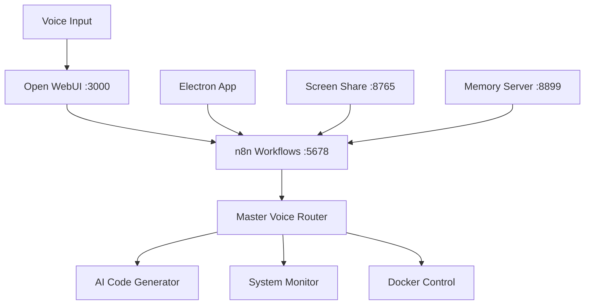

# God Max Pro - Omnipresent AI Automation System

<div align="center">
  
  ? **Voice-Controlled AI Automation Platform** ?
  
  [](https://github.com/asem187/god-max-pro)
  [](https://github.com/asem187/god-max-pro)
  [](https://github.com/asem187/god-max-pro)
  
</div>

## ? Philosophy

**God Max Pro** follows three core principles:
- **Omnipresence**: Accessible from anywhere - desktop, phone, remote
- **Maximum Capability**: No feature compromises, production-ready
- **Professional Grade**: Security-first, optimized, documented

## ?? Architecture



## ? Quick Start

```bash
# Clone the repository
git clone https://github.com/asem187/god-max-pro.git
cd god-max-pro

# Run the launcher
./scripts/LAUNCH-GOD-MAX-PRO.bat
```

## ? Components

### 1. **Electron Voice Control App**
- Location: `electron-app/`
- Features: Voice recognition, webhook testing, system monitoring
- Shortcuts: 
  - `Ctrl+Shift+V` - Activate voice
  - `Ctrl+Shift+C` - Command palette

### 2. **n8n Automation Workflows**
- Port: 5678
- Credentials: asem18@gmail.com / Janabi1221!
- Core Workflows:
  - Master Voice Router (pattern matching)
  - AI Code Generator (Claude integration)
  - System Monitor (health checks)

### 3. **Real-time Screen Sharing**
- Port: 8765 (WebSocket)
- Resolution: 1920x1080 @ 0.5Hz
- Auto task detection

### 4. **Memory Persistence System**
- Port: 8899
- Auto-briefing endpoint: `/auto-brief-new-bot`
- Docker volume backed

### 5. **Open WebUI Voice Interface**
- Port: 3000
- Phone accessible via PWA
- Native voice/video calls

## ?? Installation

### Prerequisites
- Docker Desktop
- Node.js 18+
- Windows 10/11

### Setup Steps

1. **Start Docker Services**
   ```bash
   docker-compose up -d
   ```

2. **Initialize n8n**
   - Access http://localhost:5678
   - Create account: asem18@gmail.com

3. **Launch Electron App**
   ```bash
   cd electron-app
   npm install
   npm start
   ```

4. **Configure Open WebUI**
   - Access http://localhost:3000
   - Login: asem18@gmail.com

## ? Documentation

- [Electron Pro Mastery Guide](docs/ELECTRON-PRO-MASTERY.md)
- [n8n Pro Memory Node Guide](docs/N8N-PRO-MEMORY-NODE.md)
- [God Max Pro Handoff Guide](docs/GOD-MAX-PRO-HANDOFF.md)

## ? Development

### Project Structure
```
god-max-pro/
??? electron-app/          # Desktop application
??? n8n-workflows/         # Automation workflows
??? scripts/               # Launch & utility scripts
??? docs/                  # Documentation
??? memory-server/         # Auto-briefing service
??? docker-compose.yml     # Service orchestration
```

### Key Scripts
- `LAUNCH-GOD-MAX-PRO.bat` - Start all services
- `OPEN-N8N-NOW.ps1` - Open n8n interface
- `START-AI-SCREENSHARE.bat` - Enable screen sharing
- `INSTALL-AUTO-MEMORY.bat` - Setup memory system

## ? API Endpoints

### Memory Server (8899)
- `GET /auto-brief-new-bot` - Get complete system context
- `POST /update-progress` - Log actions
- `POST /save-artifact` - Save code/workflows

### n8n Webhooks (5678)
- `/webhook/voice-command` - Voice input processing
- `/webhook/ai-screen-context` - Screen sharing data
- `/webhook/memory-enhance` - Memory operations

## ? Voice Commands

- "Generate code for..." - AI code generation
- "Check system status" - Health monitoring
- "Deploy to..." - Deployment automation
- "Research about..." - Web research
- "Create workflow..." - n8n automation

## ? Security

- Token-based authentication
- Encrypted communications
- Role-based access control
- Container isolation

## ? Mobile Access

1. **Local Network**: http://[YOUR-IP]:3000
2. **Remote Access**: Via Tailscale/WireGuard VPN
3. **PWA**: Install as mobile app

## ? Troubleshooting

### Port Conflicts
```bash
# Check ports
netstat -an | findstr "3000 5678 8765 8899"

# Fix conflicts
docker-compose down
# Edit docker-compose.yml ports
docker-compose up -d
```

### Memory Issues
```bash
# Check memory
docker run --rm -v mcp-memory:/data alpine cat /data/memory.json

# Reset memory
docker volume rm mcp-memory
docker volume create mcp-memory
```

## ? Contributing

1. Fork the repository
2. Create feature branch
3. Commit changes
4. Push to branch
5. Open Pull Request

## ? License

MIT License - see [LICENSE](LICENSE) file

## ? Acknowledgments

- Electron Framework
- n8n Workflow Automation
- Open WebUI Project
- Docker MCP Server

---

<div align="center">
  
  **Built with ?? by Asem**
  
  [Report Bug](https://github.com/asem187/god-max-pro/issues) ? [Request Feature](https://github.com/asem187/god-max-pro/issues)
  
</div>
